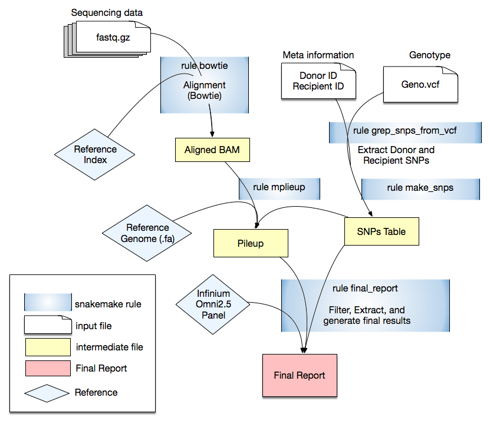

# cfCloud: A Cloud-based Workflow for Cell-Free DNA Data Analysis

Cell-free DNA (cfDNA) is double stranded, non-randomly fragmented short (<200bp) DNA molecules circulating in the blood stream as a result of apoptosis, necrosis or active secretion from cells. The amount of cfDNA in blood increases dramatically with cellular injury or necrosis and therefore, can be used as a biomarker as a non-invasive prenatal testing, tumor-derived DNA in plasma, or monitoring the graft health in an organ transplantation. The Genome Transplant Dynamics, a rigorous and highly reproducible universal NGS based method, has been commonly used to utilizes genotype information differences in recipient and donor to quantify donor derived cell-free DNA percent. Here we implement a fully automated Snakemake pipeline on-premise as well as a Cloud implementation to systematize the quantification of donor derived cell-free DNA amount.


## Installation:
<details>
<summary>
Local Installation
</summary>

<hr size=5 style="display: block; height: 3px;
    border: 0; border-top: 1px solid #ccc;
    margin: 1em 0; padding: 0;"  />

### Local Installation

#### 1. Tool Prerequisites

- [python=3.7](https://www.python.org/downloads/) 
- [samtools and bcftools](https://samtools.github.io/bcftools/howtos/install.html) 
```
    git clone --branch=develop git://github.com/samtools/htslib.git
    git clone --branch=develop git://github.com/samtools/bcftools.git
    git clone --branch=develop git://github.com/samtools/samtools.git
    cd bcftools; make
    cd ../samtools; make 
```

- [PyVCF](https://pypi.org/project/PyVCF/)
```
pip3 install PyVCF
```
- [pandas](https://pandas.pydata.org/)
```
pip3 install pandas
```
- [snakemake](https://snakemake.readthedocs.io/en/stable/index.html)
```
pip3 install snakemake
```
<br />

#### 2. Clone cfCloud
```
git clone https://github.com/NHLBI-BCB/cfCloud.git
cd cfCloud
```
<br />

#### 3. Install resources

- Bowtie2 Reference Genome <br />
Can be downloaded from [Illumina iGenomes](https://support.illumina.com/sequencing/sequencing_software/igenome.html)

```
# e.g. hg19:
cd resources
wget http://igenomes.illumina.com.s3-website-us-east-1.amazonaws.com/Homo_sapiens/UCSC/hg19/Homo_sapiens_UCSC_hg19.tar.gz
tar -xzf Homo_sapiens_UCSC_hg19.tar.gz
```
<br />

- SNPs list <br />
Can be downloaded from [Illumina Genotyping Kits](https://www.illumina.com/products/by-type/microarray-kits.html)
```
# e.g. Infinium Omni2.5:
cd reources
unzip InfiniumOmni25.hg19.snps.cleaned.zip
```

<br /><br />

<hr size=5 style="display: block; height: 3px;
    border: 0; border-top: 1px solid #ccc;
    margin: 1em 0; padding: 0;"  />
<br /><br />

</details>
<details>
<summary>
Conda Environment
</summary>

<hr size=5 style="display: block; height: 3px;
    border: 0; border-top: 1px solid #ccc;
    margin: 1em 0; padding: 0;"  />

### Conda Environment

Download an installer for Python v3. (cfCloud requires python=3.7)

distribution  | instructions
---- | ----
[Anaconda](https://www.anaconda.com/products/individual#download-section) | Current version "Python 3.7 version"
[Miniconda](https://repo.anaconda.com/miniconda/) | Download the `Miniconda3-latest-*` installer based on your operating system

Run the installer file.  Depends on. your OS. It may be an executable installer or run from the command-line: `bash INSTALLER.sh` . Please see the instruction provided with the installer.

Tool Prerequisites
```shell
conda install -c anaconda pandas
conda install -c bioconda snakemake
conda install -c bioconda bcftools
conda install -c bioconda samtools
conda install -c bioconda pyvcf
```


<hr size=5 style="display: block; height: 3px;
    border: 0; border-top: 1px solid #ccc;
    margin: 1em 0; padding: 0;"  />
<br /><br />

</details>
<details>
<summary>
Amazon Cloud
</summary>

<hr size=5 style="display: block; height: 3px;
    border: 0; border-top: 1px solid #ccc;
    margin: 1em 0; padding: 0;"  />

### Amazon Cloud


<hr size=5 style="display: block; height: 3px;
    border: 0; border-top: 1px solid #ccc;
    margin: 1em 0; padding: 0;"  />
<br /><br />

</details>
<br /><br />

## cfCloud Workflow 

<p align="center">
  
</p>


## Usage


 
